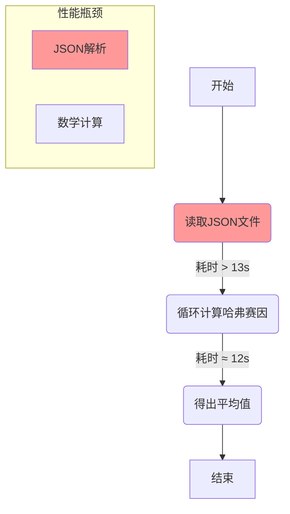

## 核心案例定义

这个案例旨在模拟一个比前言中的简单求和更真实、更复杂的编程场景。它的任务是：**计算一千万对地球表面坐标点之间的平均球面距离**。

这个任务被分解为三个主要部分，以覆盖不同的性能瓶颈：

1.  **文件I/O**: 从操作系统（以文件为例）读取一个包含坐标点对的 **JSON** 数据。
2.  **数据解析**: 将读取到的JSON文本**解析**成程序可以使用的内存数据结构。
3.  **数学计算**: 遍历所有坐标点对，使用**哈弗赛因公式 (Haversine formula)** 计算它们之间的球面距离，并最终求出平均值。

**重要约束**：课程的目标是**将这个特定的计算流程执行得尽可能快**，而不是去寻找数学上更简单或更优的替代算法。

-----

## 为什么选择这个案例？

作者精心设计这个案例，因为它巧妙地融合了多种典型的性能问题：

  * **真实性** 🌍：它源于一个真实的Stack Overflow问题，贴近程序员在工作中可能遇到的困惑。
  * **包含数学密集型计算** 📐：哈弗赛因公式本身涉及多种三角函数和数学运算 (`sin`, `cos`, `sqrt` 等)，是分析计算性能的绝佳样本。
  * **包含非数学密集型任务** 📝：强制使用 **JSON** 作为输入格式，引入了字符串处理、数据解析等非计算密集型任务的性能瓶颈。作者指出，JSON虽然效率低下，但在实际工作中非常普遍。
  * **包含系统I/O** 💾：要求从文件中读取数据，将操作系统层面的I/O性能也纳入了考量范围。

-----

## 初始Python基准测试

作者提供了一个简单的Python实现作为性能优化的起点。对一千万对坐标点运行这个基准程序，结果如下：

  * **总耗时**：约 **26 秒**
  * **吞吐量**：约 400,000 次哈弗赛因计算/秒

最关键的发现是耗时分布：

  * **JSON解析耗时**：超过 **13 秒**
  * **数学计算耗时**：约 **12 秒**

**结论**：在这个未经优化的初始版本中，**数据解析的耗时甚至超过了核心的数学计算**。这有力地说明了为什么将数据I/O和解析纳入问题是如此重要，因为它们往往是人们容易忽略的巨大性能瓶颈。

### 逻辑图：基准程序耗时分解

-----

## 课程的后续思路

接下来的课程将把这个案例拆解开，深入学习CPU的工作原理，然后针对**文件I/O、JSON解析、数学计算**这三个环节，分别估算在各自硬件上的理论最优性能，并探索如何通过性能感知编程技术，一步步接近这个极限。