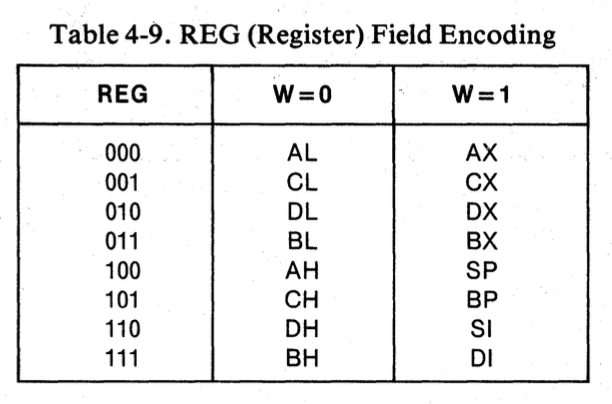

## 问题
mov          ax, bx         (16bit)
100010DW MOD|REG|R/M

ax to
bx from

## 草稿
第一个字节（0-5）：确定操作类型

第一个字节（6）：1代表REG为to，0代表R/M为to

第一个字节（7）：

第二个字节（0-1）：MOD

两位的 mod 字段是一个代码，告诉我们这是哪种类型的移动：是在两个寄存器之间，还是在寄存器和内存之间？由于我们只关注寄存器间的移动，该值始终为 11（因为我们讨论的是二进制位，所以这是两个 1，不是十一！）。11 就是"寄存器到寄存器"的代码。

第二个字节（2-4）：REG

第二个字节（5-7）：R/M

结果：0x89D9
1000 1001 | 1101 1001

cx 001
bx 101

## 编程细节
unsigned char 用于读字节

