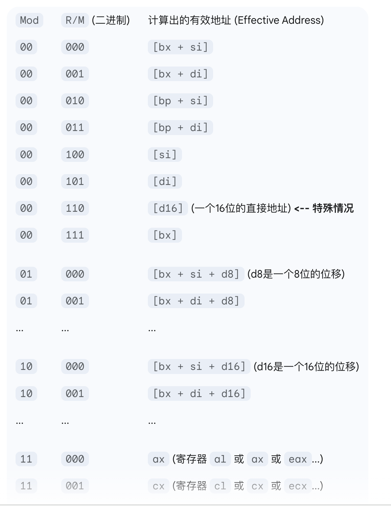

## 100010
100010DW    MOD|REG|R/M     DL DH

100010: MOV

D：1代表REG为to，0代表R/M为to

W：1代表 16bit，0代表8bit

MOD(2)(位移量): 
00  无位移量
01  8位位移量         多一个字节DL
10  16位位移量        多两个字节DL DH
11  寄存器到寄存器     不需要DL DH

REG(3)

R/M(3)

## 1011

1011WREG    

## list 39
100010DW    MOD|REG|R/M     DL DH

; ========================================================================
; LISTING 39
; ========================================================================

bits 16

; Register-to-register
mov si, bx
mov dh, al

; 8-bit immediate-to-register   
mov cl, 12          1011 0 REG | 12
mov ch, -12         1011 0 REG | -12

; 16-bit immediate-to-register  
mov cx, 12          1011 1 REG | 12 | 12
mov cx, -12         1011 1 REG | -12 | -12
mov dx, 3948        1011 1 REG | 3948 | 3948
mov dx, -3948       1011 1 REG | -3948 | -3948

; Source address calculation 
mov al, [bx + si]   10001010 | 00REG011 | si
mov bx, [bp + di]   100010D1 | 10REG101 | di
mov dx, [bp]        100010D1 | 00REG101

; Source address calculation plus 8-bit displacement
mov ah, [bx + si + 4] 100010D0 | 

; Source address calculation plus 16-bit displacement
mov al, [bx + si + 4999]

; Dest address calculation
mov [bx + di], cx
mov [bp + si], cl
mov [bp], ch