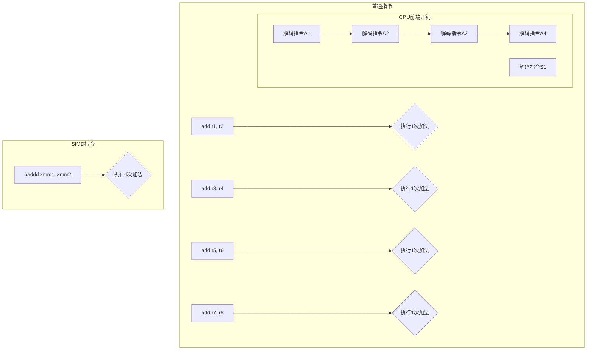

## 核心论点：SIMD是性能优化的第三个乘数

本文介绍了导致程序变慢的第三个关键因素：**SIMD (Single Instruction, Multiple Data)，即“单指令，多数据”**。与上一篇通过优化指令并行度 (IPC) 来“加速”指令不同，SIMD通过**直接减少指令总数**来提升性能。

SIMD的核心思想是，CPU可以通过一条指令同时对多个数据进行相同的操作，这非常适合处理大规模、重复性的计算任务。

-----

## SIMD如何工作？

SIMD通过使用更宽的寄存器（如128位、256位）来实现。这些宽寄存器被划分为多个“**通道**” (lanes)，每个通道可以容纳一个独立的数据。

例如，一个普通的`add`指令一次只能计算两个32位整数。而一条SSE SIMD指令 `paddd` 使用一个128位的寄存器，可以**一次性完成四个32位整数的加法**。

### 为什么SIMD能提速？

你可能会认为CPU仍然需要完成四次加法，总工作量没变。但SIMD的巨大优势在于它**节省了CPU前端的大量开销**。CPU解码指令、准备输入、检查依赖关系等工作是非常耗时的。通过SIMD，CPU只需解码**一条**指令，就能驱动后端算术单元完成相当于四条（或更多）普通指令的工作量，从而极大地提高了效率。

### 逻辑图：普通加法 vs. SIMD加法

-----

## 性能实测：SIMD与IPC的结合

文章通过实验展示了SIMD的威力，并将其与上一篇的IPC优化技巧（打破依赖链）相结合。

### 1\. 单纯使用SIMD

将原始的C语言求和循环改写为使用SIMD指令后，性能大幅提升：

  * **SSE** (4个32位整数/指令): 性能达到 **3.1次加法/周期**。
  * **AVX** (8个32位整数/指令): 性能飙升至 **7.0次加法/周期**。

这远超了上一篇中通过优化IPC达到的最高2次加法/周期的性能。

### 2\. SIMD + IPC优化

单纯的SIMD循环仍然存在**串行依赖链**的问题（只有一个SIMD累加器）。作者将上一篇“使用多个累加器”的技巧应用到AVX代码上：

  * **双累加器AVX**: 性能提升至 **9.4次加法/周期**。
  * **四累加器AVX**: 性能最终达到惊人的 **13.4次加法/周期**。

这证明了CPU有能力在一个周期内执行**多于一条**的SIMD指令，将SIMD和IPC优化结合能获得最佳性能。

-----

## 结论

1.  **SIMD威力巨大**：SIMD是获取性能巨大提升的关键技术，它通过减少指令开销来大幅提高计算吞吐量。
2.  **优化技术可以叠加**：SIMD和IPC优化是相辅相成的。结合使用这两种技术，性能得到了乘数级的增长。
3.  **惊人的总提升**：
      * 相比最初的**C语言**循环（\~0.8次加法/周期），最终优化版本快了约 **16倍**。
      * 相比最初的**Python**代码，最终优化版本的速度提升了**超过3000倍**。这证明了现代高级语言代码与底层硬件性能之间存在着巨大的鸿沟。
4.  **提醒与预告**：作者指出，本次测试的求和运算是SIMD改造的理想场景，实际应用可能更复杂。同时，所有测试都基于一个“作弊”的前提：数据量很小，能完全装入CPU缓存。下一篇文章将探讨当出现**糟糕的缓存行为 (bad cache behavior)** 时，性能会发生什么变化。