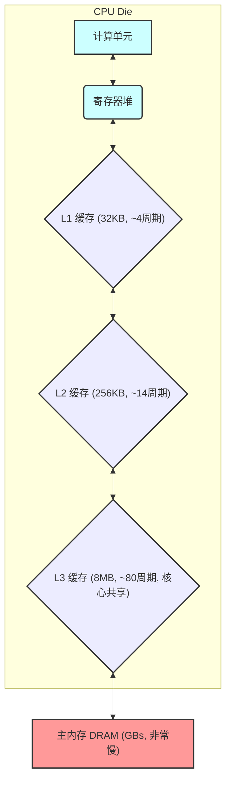

## 核心论点：缓存是性能优化的第四个乘数

继指令浪费、IPC和SIMD之后，本文探讨了第四个关键的性能乘数：**缓存 (Caching)**。文章指出，程序的算术运算（如加法）依赖于**加载 (load)** 操作来从内存中获取数据。如果加载速度跟不上，无论计算单元有多快，程序都会被拖慢。而加载速度的决定性因素就是CPU的缓存系统。

### 问题：主内存 (RAM) 为什么不够快？

CPU的计算速度远超主内存（DRAM）的数据供给速度。如果CPU每次都需要从主内存读取数据，那么它的高性能计算单元将大部分时间处于空闲等待状态，之前通过IPC和SIMD优化获得的高吞吐量将无法实现。

-----

## 解决方案：多级缓存的内存层级结构

为了解决主内存的慢速问题，CPU内部集成了一套多级缓存系统。这是一个分层的存储结构，越靠近计算核心的缓存速度越快、容量越小；反之，速度越慢、容量越大。

  * **寄存器堆 (Register File)**: 最快、最小的存储，直接为计算指令提供数据（例如循环中的累加器）。
  * **L1缓存 (Level 1 Cache)**: 直接构建在CPU核心内，非常快（约3-4个周期延迟），但容量极小（例如32KB）。数据能从L1加载是最佳情况。
  * **L2缓存 (Level 2 Cache)**: 速度和带宽次于L1，但容量更大（例如256KB）。
  * **L3缓存 (Level 3 Cache)**: 速度更慢，但容量巨大（例如8MB），通常被多个核心共享。
  * **主内存 (DRAM)**: 速度最慢，但容量极大（GB级别）。数据必须从主内存加载是性能最差的情况。

### 逻辑图：内存层级结构

-----

## 性能实测：缓存命中与错失的巨大差异

作者揭示，之前所有测试都存在一个“作弊”优势：**使用的数据集很小（16KB），可以完全放入L1缓存**，因此展示的是程序的**峰值性能**。

为了演示缓存的重要性，作者使用之前最快的程序（`QuadAVXPtr`），通过不断增大处理的数据集大小，强制CPU从更慢的缓存层级或主内存加载数据。

  * **数据源于L1缓存 (16KB)**: 峰值性能，**13.2次加法/周期**。
  * **数据源于L2缓存 (128KB)**: 性能下降近一半，为 **7.7次加法/周期**。
  * **数据源于L3缓存 (1MB)**: 性能再次大幅下降，为 **4.4次加法/周期**。
  * **数据源于主内存 (128MB)**: 性能暴跌至 **1.4次加法/周期**。

-----

## 结论

1.  **缓存是巨大的性能乘数**：仅仅因为数据无法装入L1缓存，之前通过IPC和SIMD优化获得的**16倍**性能提升几乎被完全抵消，最终性能只比最原始的C语言版本快了不到2倍。
2.  **数据访问模式至关重要**：程序的性能不仅取决于计算本身，更取决于其数据访问模式能否高效利用CPU缓存。糟糕的缓存行为对性能的损害可能比IPC和SIMD不足加起来还要严重。
3.  **预告**：还存在最后一个性能乘数，它不仅自身能提升性能，还能帮助改善缓存效率。