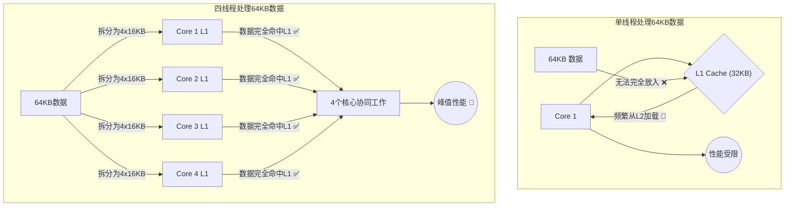

## 核心论点：多线程是潜力日益增长的性能乘数

现代电脑的CPU普遍包含多个**核心 (cores)**，每个核心都像一个独立的微型电脑，能独立运行指令。多线程就是通过编程将一个大任务分解成多个小任务，让这些核心**并行处理**，从而大幅提升速度。

如果你不使用多线程，你的程序就只能利用CPU中的一个核心，等于放弃了其余所有核心的计算能力 🐢。随着CPU核心数量不断增加（服务器CPU已达96核甚至更多），单线程程序的性能损失会越来越大，其量级甚至可以与之前提到的“指令浪费”相提并论。

-----

## 多线程与缓存的奇妙化学反应：“超线性”加速 🚀

本文最惊人的发现是，多线程不仅能并行化计算，还能与CPU缓存产生奇妙的化学反应，带来**远超核心数量的“超线性”加速**。

文章通过一个巧妙的实验证明了这一点：

1.  **场景设置**：一个64KB的数据集，对于单个核心的32KB L1缓存来说太大了，但对于四个核心的总L1缓存（4 × 32KB = 128KB）则绰绰有余。
2.  **单线程表现**：由于数据集放不进L1缓存，程序被迫从较慢的L2缓存读取数据，性能下降至约 **7次加法/周期**。
3.  **四线程表现**：程序将64KB数据集拆分为4个16KB的小块，每个线程处理一块。因为每块数据都能完美放入各自核心的L1缓存中，程序全程以最高速运行，综合性能达到 **52次加法/周期**。
4.  **惊人结果**：性能提升了 **7倍多**（52 / 7），远远超过了核心数量带来的理论4倍上限！

**结论**：多线程不仅能并行化计算，还能**有效扩大高速缓存的总容量**，让原本会因缓存不足而变慢的任务，能够保持在最高速运行。

### 逻辑图：多线程与缓存协同效应

-----

## 瓶颈与总结

文章也指出，当任务的瓶颈是主内存带宽时，多线程的加速效果会大打折扣。但总的来说，多线程是一个至关重要且潜力不断增长的性能优化手段。

至此，系列文章已阐述了导致程序变慢的**五大性能乘数**：

1.  **指令浪费 (Waste)**: 执行了与核心任务无关的指令。
2.  **指令级并行 (IPC)**: 未能利用CPU单周期内执行多条指令的能力。
3.  **单指令多数据 (SIMD)**: 未使用向量指令一次性处理多个数据。
4.  **缓存 (Caching)**: 数据访问模式糟糕，导致频繁从慢速内存加载。
5.  **多线程 (Multithreading)**: 未将任务并行化，只利用了多核CPU中的一个核心。