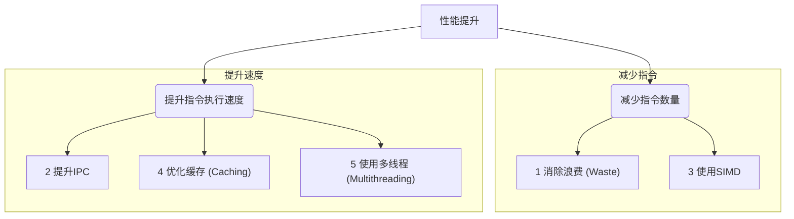

## 核心论点：你不需要成为专家，只需拥有“性能意识”

作者首先重申，从最初的Python循环到最终优化的C代码，性能差距超过了**8000倍**，这证明了现代软件与硬件能力之间存在着巨大的鸿沟。

然而，本课程的最终目标**不是**要把每个人都训练成能榨干硬件最后一滴性能的优化专家。而是要让你**理解**这五大性能乘数是如何共同作用，造成了如此巨大的性能差距。

一旦你拥有了这种“性能意识”，你就能在日常工作中，以极小的代价，轻松获得**100倍**甚至**1000倍**的性能提升，而无需花费大量精力去追求极限的8000倍。

### 总结：五大性能乘数回顾

作者将五大乘数归为两大类：**减少指令数量**和**提升指令执行速度**。

-----

## 实践：用底层知识优化Python代码

作者作为一个“Python新手”，仅凭着对底层硬件工作原理的理解，对最初的Python求和循环进行了一系列优化尝试，结果令人瞩目：

### 第1步：高级语言层面的小修小补

  * **原始Python循环**：性能为 `0.006` adds/cycle。
  * **使用内置`sum()`函数**：通过避免在Python层面进行循环，将工作交给更底层的实现，性能提升了约**10倍**。这是一个巨大的进步，但距离C语言的`2000`多倍差距还很远。

### 第2步：消除类型检查的浪费

  * **洞察**：作者意识到Python作为动态语言，其解释器在处理每个元素时都要进行大量的**类型检查**，这正是“浪费”的主要来源。
  * **解决方案**：创建一个**类型确定**的数组（明确告诉Python这个数组里只存放无符号整数），然后将其交给为这种情况优化过的库。
  * **结果**：当把这个类型确定的数组交给 `numpy.sum()` 时，性能再次**飙升**。在处理大数据集时，其性能已经能达到纯C语言版本的**1/4**！仅仅是改变了输入数据的声明方式，就获得了上百倍的性能提升。

### 第3步：终极手段 - Cython

  * **问题**：如果还需要更高的性能怎么办？
  * **解决方案**：使用 **Cython**，这个工具允许你几乎是“复制粘贴”般地将高性能的C/C++代码直接嵌入到Python程序中。
  * **结果**：作者将之前最优的AVX C代码放入Cython模块中，其性能**几乎与纯C语言版本完全相同**。这证明了，即使你主要使用Python，也完全有能力在性能瓶颈处达到C语言级别的速度。

-----

## 最终结论

1.  **Python可以跑得飞快**：问题的答案是“Python程序可以跑得和你期望的一样快”，前提是你需要知道瓶颈在哪里，并使用正确的工具（如Numpy的类型化数组，或Cython）来解决它。
2.  **知识是关键**：你不需要放弃你熟悉的语言，也不需要重写所有代码。你只需要学习并**理解高性能代码在底层是如何工作的**。
3.  **性能意识的价值**：这种底层知识会指导你在高层次上做出更明智的架构决策，让你知道何时以及如何利用语言生态中的工具来轻松跨越巨大的性能鸿沟。这正是“性能感知编程”的精髓所在。